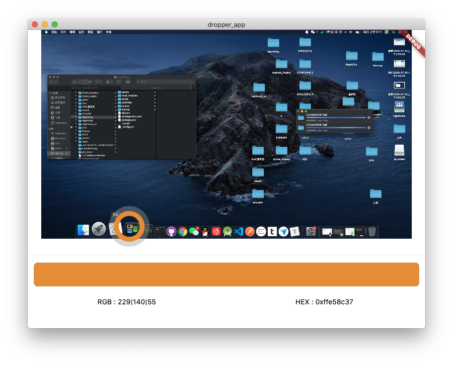

# dropper

这是一个使用 Flutter 编写的简易颜色取色器。
由于该项目不依赖任何的平台代码，所以你可以使用下面的方式来集成到任何 Flutter 项目中。
```yaml
  dropper:
    git: https://github.com/nightmare-space/dropper
```
## 开始使用
运行 example 。
## 截图
### macos

